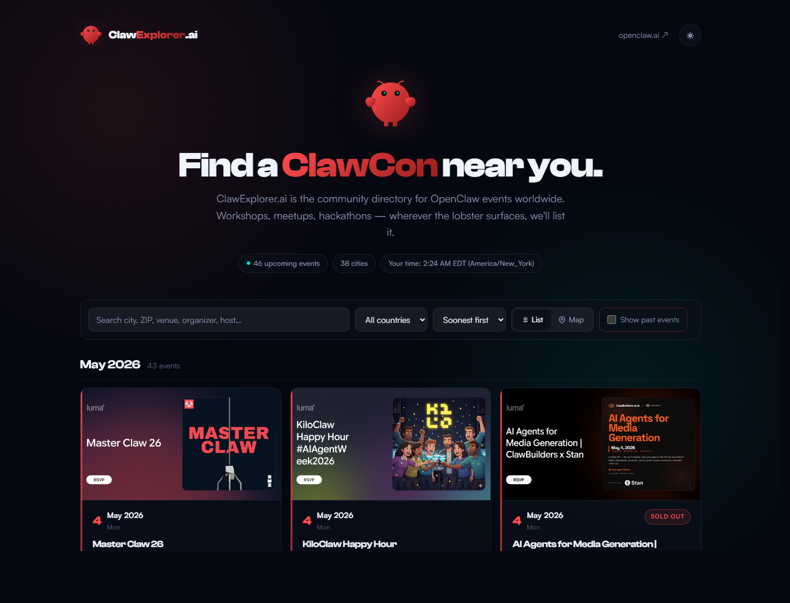
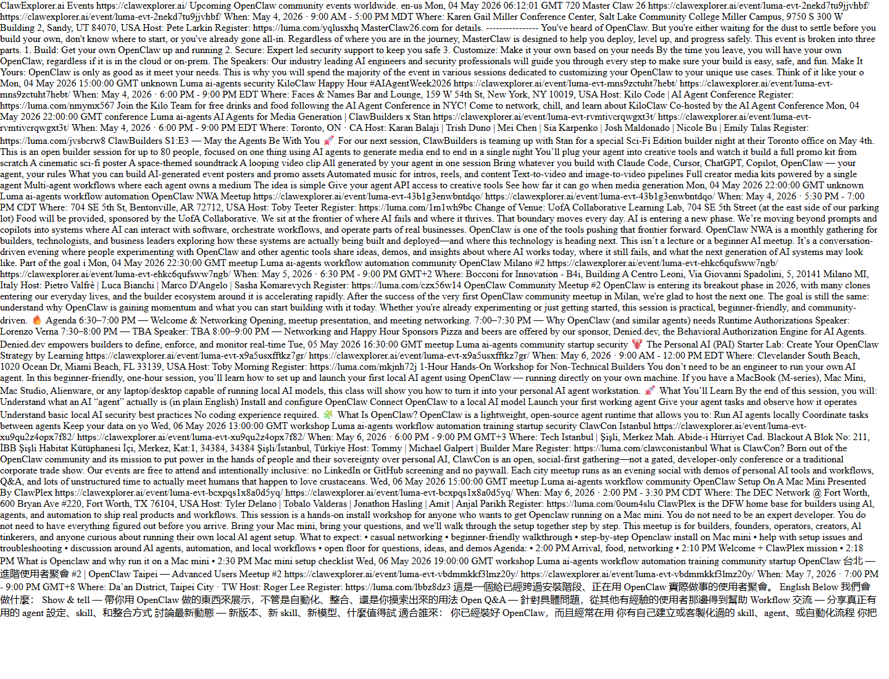

# ClawExplorer.ai Public Changelog

Public, summary-only release notes for ClawExplorer.ai.

The application source repository remains private. This repository intentionally does not publish source files, patches, diffs, private workflow logs, secrets, server paths, or implementation-level code.

## Public Surfaces

- Live site: https://clawexplorer.ai/
- Events RSS feed: https://clawexplorer.ai/feed.xml
- Calendar feed: https://clawexplorer.ai/calendar.ics
- Sitemap: https://clawexplorer.ai/sitemap.xml

## Latest Screenshots

| Surface | Screenshot |
| --- | --- |
| Homepage events directory |  |
| RSS feed response in browser |  |

## What Gets Published Here

- PR number and title
- Summary of user-facing or operational change
- Public production URL affected by the change
- Test commands or validation outcomes reported for the change
- Deploy status and run ID, without private logs
- Live-site screenshots when useful

## Update Workflow

Every private ClawExplorer.ai PR asks whether the change should be added here after merge. Only PRs marked "Yes" by the maintainer should be mirrored into this public changelog.

## What Does Not Get Published

- Source code
- Patch diffs
- Commit diffs
- Private repository links that require access
- Secrets, deploy keys, server usernames, host paths, or internal logs

## Changelog

See [CHANGELOG.md](CHANGELOG.md).
